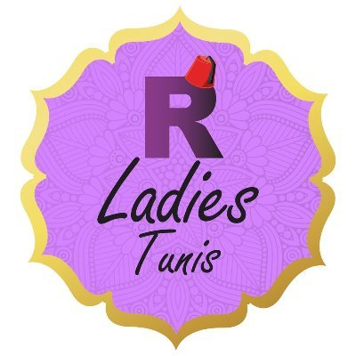

<!-- badges: start -->
[](https://github.com/stemangiola/rladiestunis2021_tidytranscriptomics/actions) [](https://hub.docker.com/repository/docker/stemangiola/rladiestunis2021_tidytranscriptomics) 	
<!-- badges: end -->

# Introduction to Tidy Transcriptomics
<p float="left">


</p>

## Instructor names and contact information

* Maria Doyle <Maria.Doyle at petermac.org>  
* Stefano Mangiola <mangiola.s at wehi.edu.au>

## Syllabus

Material [web page](https://stemangiola.github.io/rladiestunis2021_tidytranscriptomics/articles/tidytranscriptomics.html).

More details on the workshop are below.

## Workshop package installation 

This is necessary in order to reproduce the code shown in the workshop. The workshop is designed for R `4.0` and can be installed using one of the two ways below.

### Via Docker image

If you're familiar with [Docker](https://docs.docker.com/get-docker/) you could use the Docker image which has all the software pre-configured to the correct versions.

```
docker run -e PASSWORD=abc -p 8787:8787 stemangiola/rladiestunis2021_tidytranscriptomics:rladiestunis2021
```

Once running, navigate to <http://localhost:8787/> and then login with
`Username:rstudio` and `Password:abc`.

You should see the Rmarkdown file with all the workshop code which you can run.

### Via GitHub

Alternatively, you could install the workshop using the commands below in R `4.0`.

```
#install.packages('remotes')

# Need to set this to prevent installation erroring due to even tiny warnings, similar to here: https://github.com/r-lib/remotes/issues/403#issuecomment-748181946
Sys.setenv("R_REMOTES_NO_ERRORS_FROM_WARNINGS" = "true")

# Install workshop package
remotes::install_github("stemangiola/rladiestunis2021_tidytranscriptomics", build_vignettes = TRUE)

# To view vignettes
library(rladiestunis2021tidytranscriptomics)
browseVignettes("rladiestunis2021tidytranscriptomics")
```

To run the code, you could then copy and paste the code from the workshop vignette or [R markdown file](https://raw.githubusercontent.com/stemangiola/rladiestunis2021_tidytranscriptomics/master/vignettes/tidytranscriptomics.Rmd) into a new R Markdown file on your computer.

## Workshop Description

This workshop will present how to perform analysis of RNA sequencing data following the tidy data paradigm. The tidy data paradigm provides a standard way to organise data values within a dataset, where each variable is a column, each observation is a row, and data is manipulated using an easy-to-understand vocabulary. Most importantly, the data structure remains consistent across manipulation and analysis functions.

This can be achieved for RNA sequencing data with the [tidySummarizedExperiment](https://stemangiola.github.io/tidySummarizedExperiment/), [tidybulk](https://stemangiola.github.io/tidybulk/), [tidyseurat](https://stemangiola.github.io/tidyseurat/), [tidySingleCellExperiment](https://stemangiola.github.io/tidySingleCellExperiment/),  [tidyHeatmap](https://stemangiola.github.io/tidyHeatmap/) and [tidyverse](https://www.tidyverse.org/) packages. The tidybulk package provides a tidy data structure and a modular framework for bulk transcriptional analyses, the tidyseurat and tidySingleCellExperiment packages provide similar for single-cell, and tidyHeatmap provides a tidy implementation of ComplexHeatmap. These packages are part of the tidytranscriptomics suite that introduces a tidy approach to RNA sequencing data.

### Pre-requisites

* Basic knowledge of RStudio
* Some familiarity with tidyverse syntax
* Some familiarity with bulk RNA-seq and single cell RNA-seq

Recommended Background Reading
[Introduction to R for Biologists](https://melbournebioinformatics.github.io/r-intro-biologists/intro_r_biologists.html)

### Workshop Participation

The workshop format is a 2 hour session consisting of hands-on demos and Q&A.

### _R_ / _Bioconductor_ packages used

* tidyverse
* tidybulk
* tidySummarizedExperiment
* tidySingleCellExperiment
* tidyHeatmap
* limma
* edgeR
* DESeq2
* airway
* org.Hs.eg.db
* dittoSeq
* ggrepel
* GGally
* plotly


### Time outline

Guide

| Activity - Hands on demos with Q&A                                 | Time |
|--------------------------------------------------------------------|------|
| Part 1 Bulk RNA-seq with tidybulk                                  |  60  |
| Part 2 Single-cell RNA-seq with tidySingleCellExperiment           |  60  |
| Total                                                              | 120m |

### Workshop goals and objectives

In exploring and analysing RNA sequencing data, there are a number of key concepts, such as filtering, scaling, dimensionality reduction, hypothesis testing, clustering and visualisation, that need to be understood. These concepts can be intuitively explained to new users, however, (i) the use of a heterogeneous vocabulary and jargon by methodologies/algorithms/packages, (ii) the complexity of data wrangling, and (iii) the coding burden, impede effective learning of the statistics and biology underlying an informed RNA sequencing analysis.

The tidytranscriptomics approach to RNA sequencing data analysis abstracts out the coding-related complexity and provides tools that use an intuitive and jargon-free vocabulary, enabling focus on the statistical and biological challenges.

#### Learning goals

* To understand the key concepts and steps of RNA sequencing data analysis
* To approach data representation and analysis though a tidy data paradigm, integrating tidyverse with tidybulk, tidySingleCellExperiment and tidyHeatmap.

#### Learning objectives

* Recall the key concepts of RNA sequencing data analysis
* Apply the concepts to publicly available data
* Create plots that summarise the information content of the data and analysis results
